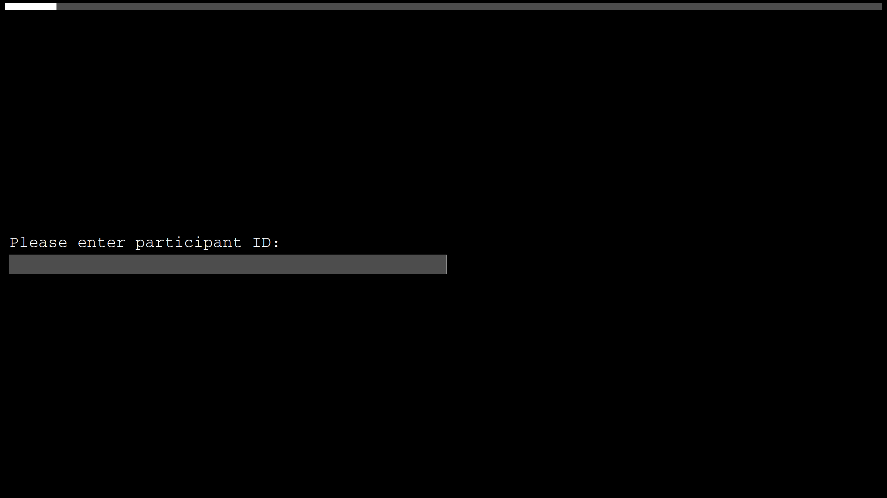

Chamois is a Python application that aims to make eye-tracking experiments on reading behavior as easy as possible.  The focus is on stimulus presentation.  Chamois doesn’t support any particular eye-tracker out of the box.  But it is relatively easy to make it work with any eye-tracker that has a Python API.

Current status: I wrote Chamois for my own lab and share it without any warranty.  It largely works, but is still at a very early stage of development.  Don’t use it for serious work!

Key features:
- Chamois is inspired by Ibex: Configuration and data format are similar but much simpler.
- Support for Latin square designs.  Just drop your sentences and you’re good to go.
- Can be combined with most eye-trackers via PyGaze and manufacturer-provided APIs such as pylink and pypixx.
- Runs on Linux, MacOS, and Windows.  Only dependency is [PySimpleGui](https://www.pysimplegui.org).
- With only around 250 lines of code, Chamois is easy to hack even for users with basic Python knowledge.

# Demo experiment

## Stimuli

``` python
target_sentences = [
  [1, "a", "While Bill hunted the deer was hunted by Bill.", "Did Bill hunt the deer?"],
  [1, "b", "While Bill hunted the deer that was brown and nimble was hunted by Bill.", "Did Bill hunt the deer?"],
  [2, "a", "While Mary bathed the baby bathed Mary.", "Did Mary bath the baby?"],
  [2, "b", "While Mary bathed the baby that was small and cute bathed Mary.", "Did Mary bath the baby?"],
  [3, "a", "Anna scolded the chef of the aristocrats who was routinely letting food go to waste.", "Did food go to waste?"],
  [3, "b", "Anna studied with the chef of the aristocrats who was routinely letting food go to waste.", "Did food go to waste?"],
]

fillers = [
  [20, "filler", "Colorless green ideas sleep furiously.", "Does this sentence make any sense at all?"],
  [21, "filler", "No head injury is too trivial to be ignored.", "Did that sentence make your brain hurt?"],
]

# Mix and shuffle :
stimuli = random.choice(latin_square_lists(target_sentences))
stimuli += fillers
random.shuffle(stimuli)
```

## Experiment

An experiment consists of a series of “pages” that are displayed one by one.  Different types of pages are predefined but it’s easy to add new types of pages.

``` python

# Load Chamois:
exec(open("chamois.py").read())

# Change theme:
theme('Black')

pages = []
# A message stored in the results file along with a time stamp:
pages.append(Message("Start of session"))

# Welcome screen:
pages.append(
  CenteredInstructions("Welcome to this study!", "Continue"))

# Asks user to enter subject ID:
pages.append(SubjectIDPage())

# Experimental trials:
for i,c,s,q in stimuli:
  pages.append(ReadingTrial(i,c,s))
  if random.choice([True, False]):
    pages.append(YesNoQuestionTrial(i,c,q))

# Thank-you screen:
pages.append(
  CenteredInstructions("Thank you for your participation!", "Exit"))

# A message stored in the results file along with a time stamp:
pages.append(Message("End of session"))

# Run experiment:
run_experiment(pages)
```

## Screenshots





## Output

Output comes in tab-separated values format (`.tsv`) and includes the AOIs of the individual words.  Screenshots of the stimulus screens are separately stored on disk.

Results file:

``` 
type	starttime	endtime	item	condition	stimulus	response	screenshot	metadata
Message	1702732592.0449314							Start of session
CenteredInstructions	1702732592.0449767	1702732592.8204858						
SubjectIDPage	1702732592.8210366	1702732595.677696				001		
ReadingTrial	1702732595.6792064	1702732598.4286556	21	filler	No head injury is too trivial to be ignored.		/tmp/21_filler_ReadingTrial.png	75,680,121,725;131,680,219,725;229,680,359,725;369,680,415,725;425,680,492,725;502,680,653,725;663,680,709,725;719,680,765,725;775,680,947,725
ReadingTrial	1702732598.4291706	1702732600.9246044	1	b	While Bill hunted the deer that was brown and nimble was hunted by Bill.		/tmp/1_b_ReadingTrial.png	75,680,184,725;194,680,282,725;292,680,422,725;432,680,499,725;509,680,597,725;607,680,695,725;705,680,772,725;782,680,891,725;901,680,968,725;978,680,1108,725;1118,680,1185,725;1195,680,1325,725;1335,680,1381,725;1391,680,1500,725
YesNoQuestionTrial	1702732600.9249854	1702732602.166412	1	b	Did Bill hunt the deer?	Yes	/tmp/1_b_YesNoQuestionTrial.png	
ReadingTrial	1702732602.167954	1702732604.7166016	20	filler	Colorless green ideas sleep furiously.		/tmp/20_filler_ReadingTrial.png	75,680,268,725;278,680,387,725;397,680,506,725;516,680,625,725;635,680,849,725
YesNoQuestionTrial	1702732604.716971	1702732606.0231833	20	filler	Does this sentence make any sense at all?	Yes	/tmp/20_filler_YesNoQuestionTrial.png	
CenteredInstructions	1702732606.024852	1702732607.0927289						
Message	1702732607.0930743							End of session
``` 

Results in table format:

| type                 | starttime          | endtime            | item | condition | stimulus                                                                 | response | screenshot                            | metadata                                                                                                                                                                                                                                |
|----------------------|--------------------|--------------------|------|-----------|--------------------------------------------------------------------------|----------|---------------------------------------|-----------------------------------------------------------------------------------------------------------------------------------------------------------------------------------------------------------------------------------------|
| Message              | 1702732592.0449314 |                    |      |           |                                                                          |          |                                       | Start of session                                                                                                                                                                                                                        |
| CenteredInstructions | 1702732592.0449767 | 1702732592.8204858 |      |           |                                                                          |          |                                       |                                                                                                                                                                                                                                         |
| SubjectIDPage        | 1702732592.8210366 | 1702732595.677696  |      |           |                                                                          | 001      |                                       |                                                                                                                                                                                                                                         |
| ReadingTrial         | 1702732595.6792064 | 1702732598.4286556 | 21   | filler    | No head injury is too trivial to be ignored.                             |          | /tmp/21_filler_ReadingTrial.png       | 75,680,121,725;131,680,219,725;229,680,359,725;369,680,415,725;425,680,492,725;502,680,653,725;663,680,709,725;719,680,765,725;775,680,947,725                                                                                          |
| ReadingTrial         | 1702732598.4291706 | 1702732600.9246044 | 1    | b         | While Bill hunted the deer that was brown and nimble was hunted by Bill. |          | /tmp/1_b_ReadingTrial.png             | 75,680,184,725;194,680,282,725;292,680,422,725;432,680,499,725;509,680,597,725;607,680,695,725;705,680,772,725;782,680,891,725;901,680,968,725;978,680,1108,725;1118,680,1185,725;1195,680,1325,725;1335,680,1381,725;1391,680,1500,725 |
| YesNoQuestionTrial   | 1702732600.9249854 | 1702732602.166412  | 1    | b         | Did Bill hunt the deer?                                                  | Yes      | /tmp/1_b_YesNoQuestionTrial.png       |                                                                                                                                                                                                                                         |
| ReadingTrial         | 1702732602.167954  | 1702732604.7166016 | 20   | filler    | Colorless green ideas sleep furiously.                                   |          | /tmp/20_filler_ReadingTrial.png       | 75,680,268,725;278,680,387,725;397,680,506,725;516,680,625,725;635,680,849,725                                                                                                                                                          |
| YesNoQuestionTrial   | 1702732604.716971  | 1702732606.0231833 | 20   | filler    | Does this sentence make any sense at all?                                | Yes      | /tmp/20_filler_YesNoQuestionTrial.png |                                                                                                                                                                                                                                         |
| CenteredInstructions | 1702732606.024852  | 1702732607.0927289 |      |           |                                                                          |          |                                       |                                                                                                                                                                                                                                         |
| Message              | 1702732607.0930743 |                    |      |           |                                                                          |          |                                       | End of session                                                                                                                                                                                                                          |

Note that each column contains only one type of data.  This makes it easy to work with this format: just `read.csv` the file in R and you’re ready to go.

Columns:

- `type`: The type of page that was displayed (or “Message” which appears only in the results file, not on screen during the experiment).
- `starttime`: The time at which the page was displayed.
- `endtime`: The time at which the page was left.
- `item`: The item number of the displayed stimulus (if any).
- `condition`: The condition of the displayed stimulus (if any).
- `stimulus`: The displayed stimulus (if any).
- `response`: The response (if any).
- `screenshot`: A screenshot of the page if a stimulus was displayed.
- `metadata`: Meta data depending on page type.  For ReadingTrials, this column contains the AOIs for each word.

The data format of the eye-tracking data depends on the eye-tracker and the user will have to take care of combining Chamois’ data and the eye-tracking data.
