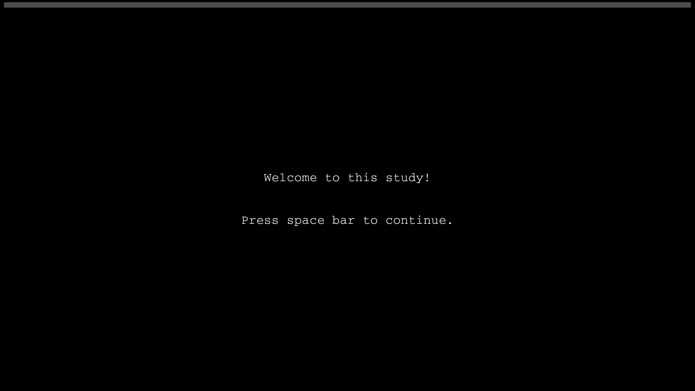
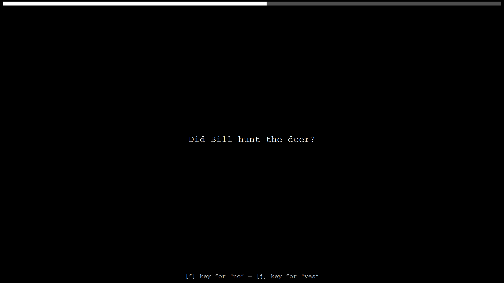

Chamois is a Python application that aims to make eye-tracking experiments on reading behavior as easy as possible.  The focus is on stimulus presentation and recording of user responses.  Chamois doesn’t support any particular eye-tracker out of the box.  But it is relatively easy to make it work with any eye-tracker that has a Python API.  An simple demo experiment for TRACKPixx3 trackers is linked below.

**Current status:** I wrote Chamois for my own lab and share it without any warranty.  It largely works, but is still in early stages of development may have some rough edges.

**Key features:**
- Chamois is inspired by Ibex: Configuration and data format are similar but simpler.
- Aims to implement all the usual best-practices, so that users don’t have to reinvent the wheel.
- Support for Latin square designs.  Just drop your sentences and you’re good to go.
- Chamois is eye-tracker agnostic and can be combined with almost any eye-tracking system via [PyGaze](https://www.pygaze.org/).  Using manufacturer APIs such as pylink and pypixx is of course also possible.
- Runs on Linux, MacOS, and Windows.  Only dependency is [PySimpleGui](https://www.pysimplegui.org).
- With only around 300 lines of code, Chamois is easy to hack and extend even for users with only basic Python knowledge.

# Demo experiment

Below is the code for a very simple experiment with 3 items, 2 conditions, 2 fillers, but no practice sentences.

Two slightly more elaborate examples:
- [demo_experiment.py](https://github.com/tmalsburg/chamois/blob/main/demo_experiment.py): As below but with practice sentences.
- [demo_experiment_tpx.py](https://github.com/tmalsburg/chamois/blob/main/demo_experiment_tpx.py): As below but with practice sentences and recording of eye movement using a [TRACKPixx3](https://vpixx.com/products/trackpixx/) eye-tracker.  Note how the code for this experiment differes only minimally from the code for an experiment without eye-tracker.

## Stimuli

``` python
target_sentences = [
  [1, "a", "While Bill hunted the deer was hunted by Bill.", "Did Bill hunt the deer?"],
  [1, "b", "While Bill hunted the deer that was brown and nimble was hunted by Bill.", "Did Bill hunt the deer?"],
  [2, "a", "While Mary bathed the baby bathed Mary.", "Did Mary bath the baby?"],
  [2, "b", "While Mary bathed the baby that was small and cute bathed Mary.", "Did Mary bath the baby?"],
  [3, "a", "Anna scolded the chef of the aristocrats who was routinely letting food go to waste.", "Did food go to waste?"],
  [3, "b", "Anna studied with the chef of the aristocrats who was routinely letting food go to waste.", "Did food go to waste?"],
]

fillers = [
  [20, "filler", "Colorless green ideas sleep furiously.", "Does this sentence make any sense at all?"],
  [21, "filler", "No head injury is too trivial to be ignored.", "Did that sentence make your brain hurt?"],
]

# Select most underrepresented Latin square list:
stimuli = next_latin_square_list(target_sentences)

# Mix and shuffle :
stimuli += fillers
random.shuffle(stimuli)
```

## Experiment structure

An experiment consists of a series of “pages” that are displayed one by one.  Each page produces one line in the results file.  Various types of pages are predefined (reading trials, acceptability judgment trials), but it’s really easy to add new types of pages.

``` python
# Load Chamois:
exec(open("chamois.py").read())

# Set the visual theme:
theme('Black')
font = "Courier"
fontsize = 22
wordspacing = 18

# Structure of experiment:
pages = []

# A message stored in the results file along with a time stamp (not
# visible for participant):
pages.append(Message("Start of session"))

# Welcome screen:
pages.append(
  CenteredInstructions("Welcome to this study!"))

# Asks user to enter subject ID:
pages.append(SubjectIDPage())

# Experimental trials with comprehension question after 50% of the
# sentences:
for item, condition, sentence, question in stimuli:
  pages.append(ReadingTrial(item, condition, sentence))
  if random.choice([True, False]):
    pages.append(YesNoQuestionTrial(item, condition, question))

# Thank-you screen:
pages.append(
  CenteredInstructions("Thank you for your participation!"))

# A message stored in the results file along with a time stamp (again
# not visible to participat):
pages.append(Message("End of session"))

# Run experiment:
run_experiment(pages)
```

## Screenshots







## Output

Output comes in tab-separated values format (`.tsv`) and includes the AOIs of the individual words.  Screenshots of the stimulus screens are stored on disk.  All filenames belonging to a session start with the session ID.

Results file (e.g. `49118eac-4846-487e-a2ac-7e5d68a03ab8_log.tsv`):

``` 
type	starttime	endtime	item	condition	stimulus	response	screenshot	metadata1	metadata2	
Message	0.000							Start of session	
CenteredInstructions	0.000	14.055			Welcome to this study!				
SubjectIDPage	14.070	18.509				subject01			
ReadingTrial	40.271	43.455	1	b	While Bill hunted the deer that was brown and nimble was hunted by Bill.		1579e43f-2b0d-4370-9169-057397713067_ReadingTrial_001_b.png	77,704,221,761;239,704,355,761;373,704,545,761;563,704,651,761;669,704,785,761;803,704,919,761;937,704,1025,761;1043,704,1187,761;1205,704,1293,761;1311,704,1483,761;1501,704,1589,761;1607,704,1779,761;1797,704,1857,761;1875,704,2019,761	
YesNoQuestionTrial	43.470	48.545	1	b	Did Bill hunt the deer?	no	1579e43f-2b0d-4370-9169-057397713067_YesNoQuestionTrial_001_b.png		
ReadingTrial	48.560	52.726	21	filler	No head injury is too trivial to be ignored.		1579e43f-2b0d-4370-9169-057397713067_ReadingTrial_021_filler.png	77,704,137,761;155,704,271,761;289,704,461,761;479,704,539,761;557,704,645,761;663,704,863,761;881,704,941,761;959,704,1019,761;1037,704,1265,761	
YesNoQuestionTrial	52.741	53.375	21	filler	Did that sentence make your brain hurt?	no	1579e43f-2b0d-4370-9169-057397713067_YesNoQuestionTrial_021_filler.png		
ReadingTrial	53.390	55.383	3	b	Anna studied with the chef of the aristocrats who was routinely letting food go to waste.		1579e43f-2b0d-4370-9169-057397713067_ReadingTrial_003_b.png	77,704,193,761;211,704,411,761;429,704,545,761;563,704,651,761;669,704,785,761;803,704,863,761;881,704,969,761;987,704,1299,761;1317,704,1405,761;1423,704,1511,761;1529,704,1785,761;1803,704,2003,761;2021,704,2137,761;2155,704,2215,761;2233,704,2293,761;2311,704,2483,761	
YesNoQuestionTrial	55.396	56.436	3	b	Did food go to waste?	no	1579e43f-2b0d-4370-9169-057397713067_YesNoQuestionTrial_003_b.png		
ReadingTrial	56.451	58.252	20	filler	Colorless green ideas sleep furiously.		1579e43f-2b0d-4370-9169-057397713067_ReadingTrial_020_filler.png	77,704,333,761;351,704,495,761;513,704,657,761;675,704,819,761;837,704,1121,761	
YesNoQuestionTrial	58.253	59.058	20	filler	Does this sentence make any sense at all?	no	1579e43f-2b0d-4370-9169-057397713067_YesNoQuestionTrial_020_filler.png		
ReadingTrial	59.0730	60.640	2	a	While Mary bathed the baby bathed Mary.		1579e43f-2b0d-4370-9169-057397713067_ReadingTrial_002_a.png	77,704,221,761;239,704,355,761;373,704,545,761;563,704,651,761;669,704,785,761;803,704,975,761;993,704,1137,761	
CenteredInstructions	60.655	66.013			Thank you for your participation!				
Message	66.028							End of session	
``` 

Results in table format:

| type                 | starttime | endtime | item | condition | stimulus                                                                                  | response | screenshot                                                          | metadata1                                                       | metadata2 |
|----------------------|-----------|---------|------|-----------|-------------------------------------------------------------------------------------------|----------|---------------------------------------------------------------------|-----------------------------------------------------------------|-----------|
| Message              |  0.000    |         |      |           | Start of session                                                                          |          |                                                                     |                                                                 |           |
| CenteredInstructions |  0.000    | 14.055  |      |           | Welcome to this study!                                                                    |          |                                                                     |                                                                 |           |
| SubjectIDPage        | 14.070    | 18.509  |      |           |                                                                                           |          |                                                                     | subject01                                                       |           |
| ReadingTrial         | 40.271    | 43.455  | 1    | b         | While Bill hunted the deer that was brown and nimble was hunted by Bill.                  |          | `1579e43f-2b0d-4370-9169-057397713067_ReadingTrial_001_b.png`       | 77,704,221,761;239,704,355,761;373,704,545,761;563,704,651,761; |           |
| YesNoQuestionTrial   | 43.470    | 48.545  | 1    | b         | Did Bill hunt the deer?                                                                   | no       | `1579e43f-2b0d-4370-9169-057397713067_YesNoQuestionTrial_001_b.png` |                                                                 |           |
| ReadingTrial         | 48.560    | 52.726  | 21   | filler    | No head injury is too trivial to be ignored.                                              |          | `1579e43f-2b0d-4370-9169-057397713067_ReadingTrial_021_filler.png`  | 77,704,137,761;155,704,271,761;289,704,461,761;479,704,539,761; |           |
| ReadingTrial         | 53.390    | 55.383  | 3    | b         | Anna studied with the chef of the aristocrats who was routinely letting food go to waste. |          | `1579e43f-2b0d-4370-9169-057397713067_ReadingTrial_003_b.png`       | 77,704,193,761;211,704,411,761;429,704,545,761;563,704,651,761; |           |
| YesNoQuestionTrial   | 55.396    | 56.436  | 3    | b         | Did food go to waste?                                                                     | no       | `1579e43f-2b0d-4370-9169-057397713067_YesNoQuestionTrial_003_b.png` |                                                                 |           |
| ReadingTrial         | 56.451    | 58.252  | 20   | filler    | Colorless green ideas sleep furiously.                                                    |          | `1579e43f-2b0d-4370-9169-057397713067_ReadingTrial_020_filler.png`  | 77,704,333,761;351,704,495,761;513,704,657,761;675,704,819,761; |           |
| ReadingTrial         | 59.073    | 60.640  | 2    | a         | While Mary bathed the baby bathed Mary.                                                   |          | `1579e43f-2b0d-4370-9169-057397713067_ReadingTrial_002_a.png`       | 77,704,221,761;239,704,355,761;373,704,545,761;563,704,651,761; |           |
| CenteredInstructions | 60.655    | 66.013  |      |           | Thank you for your participation!                                                         |          |                                                                     |                                                                 |           |
| Message              | 66.028    |         |      |           | End of session                                                                            |          |                                                                     |                                                                 |           |

Note that each column contains only one type of data.  This makes it easy to work with this format: just `read.csv` the file in R and you’re ready to go.

Columns:

1. `type`: The type of page that was displayed (or “Message” which appears only in the results file, not on screen during the experiment).
2. `starttime`: The time at which the page was displayed, in seconds with precision down to milliseconds.  The clock starts at the beginning of the experiment (`0.000`).
3. `endtime`: The time at which the page was left.
4. `item`: The item number of the displayed stimulus (if any).
5. `condition`: The condition of the displayed stimulus (if any).
6. `stimulus`: The displayed stimulus (if any).  Could also be the instructions that were displayed (potentially abbreviated).
7. `response`: The response (if any).
8. `screenshot`: Filename of screenshot of the page if a stimulus was displayed.
9. `metadata1`: Meta data depending on page type.  For ReadingTrials, this column contains the screen coordinates of the AOIs.
10. `metadata2`: More meta data depending on page type.  For TPxReadingTrials, this column contains the file name of the recorded eye-tracking data.

The data format of the eye-tracking data depends on the eye-tracker and the user will have to take care of combining Chamois log data (above) with the eye-tracking data.  In many cases this will boil down to simply joining two data frames.
